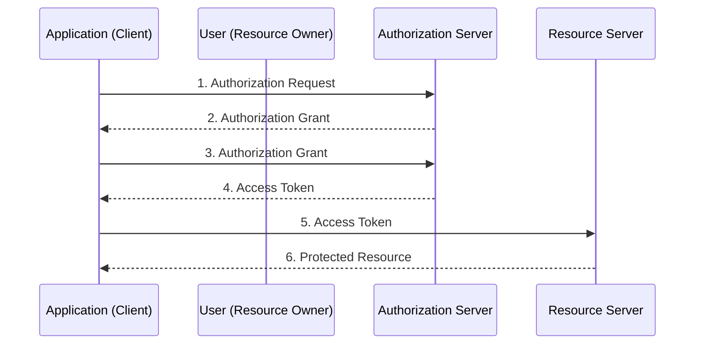
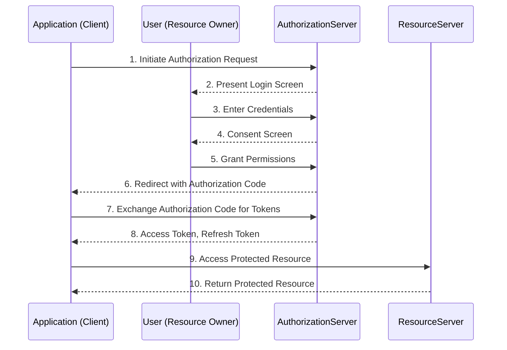
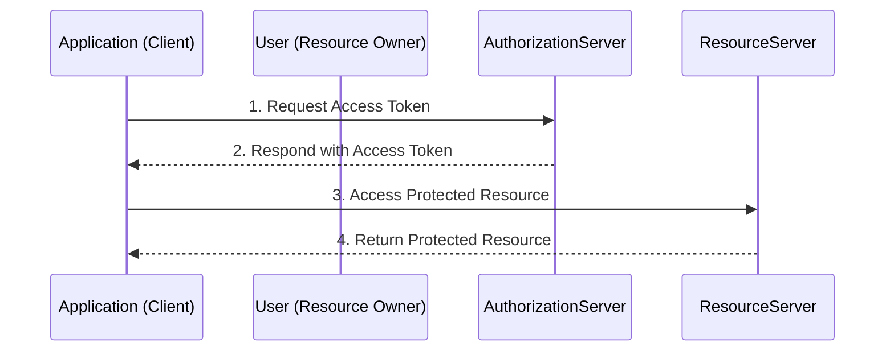
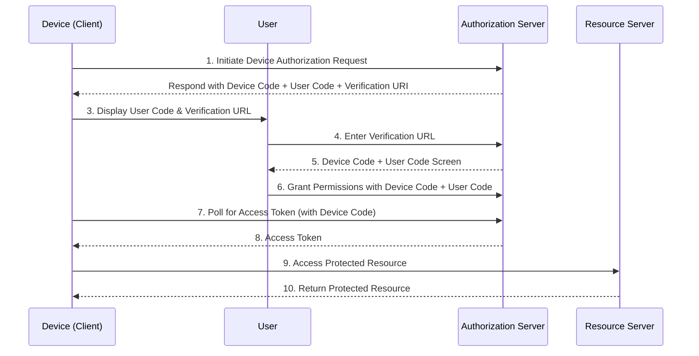
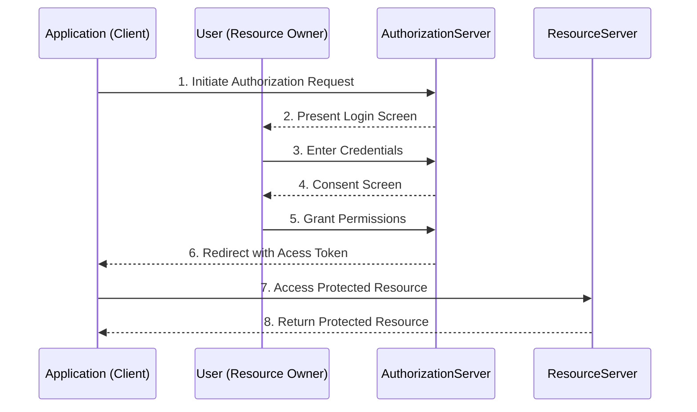
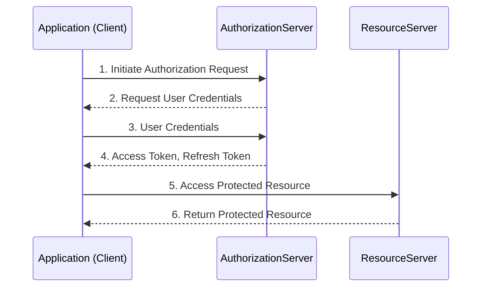

+++
title = "OAuth 2.0"
date = "2024-06-24"
description = "OAuth 2.0 is an authorization framework that allows users to grant access to their data for third-party applications without providing a username and password."
[taxonomies]
tags = ["OAuth 2.0", "authorization", "authentication","security","architecture","api","credential"]
[extra]
mermaid = true

+++

## INTRODUCTION

OAuth 2.0 is an authorization framework that allows users to grant access to their data for third-party applications without providing a username and password. While granting access to the third-party application, users can see which their data is shared. Furthermore, users can restrict actions of what the client app on their data by revoking access then if necessary. 

OAuth 2.0 has been introduced as a major revision of OAuth 1.0, providing important improvements. Moreover, it has become standard in the area of the software industry. With this authorization framework, sharing data between applications and services is possible without the need to share users' credentials due to the structure of OAuth 2.0, which is a critical foundation element to enhance the level of security for authorization in the process of software development. On the other hand, OAuth 2.1 has been discussed currently as the new version of it. 

OAuth 2.0 has a critical effect in providing web security. Thus, it is important to ensure that the implementation of OAuth 2.0 follows best practices and security standards. Otherwise, if the implementation of OAuth 2.0 is not been properly, it can expose the system to several security vulnerabilities. Thus, this article represents an overview of OAuth 2.0.

## BACKGROUND

Authentication and authorization refer to the foundational security processes for safeguarding systems and information. Although they are related terms, it has means different purposes. While authentication defines the standards for a user's identification, authorization consists of the process of controlling whether an application has been granted access or not to data. The properties of both terms are summarized in the below table.

| **Authentication**                                           | **Authorization**                                            |
| ------------------------------------------------------------ | ------------------------------------------------------------ |
| Check if users have proper identification to log in to the system. | Check whether the system has the grant to access the users' data. |
| Take the credentials from users to authenticate.             | Retrieve the data granted access by users.                   |
| Operation is commonly performed before granting authorization. | The operation is carried out after successful authentication. |

## OAUTH 2.0

OAuth 2.0 is an authorization framework that was first introduced in 2012. It has become the de facto standard for authorization because it has a set of guidelines and protocols practically applicable for secure authorization. The goal of designing the framework is to allow any client or application to access user's resources without the need for their vulnerable credentials such as passwords, and usernames. 

In short, OAuth 2.0 provides a standard, which stands for a framework that users to grant access to their data for other applications without their credentials. On the other hand, users who want to share their data with other applications can restrict actions done by it due to deciding which their data share or not. Namely, the framework adds an extra layer of security to the system. Thus, users ensure their data remains private and secure. That's why reason the framework has been widely used by many platforms and technology companies such as Google, Microsoft, Linkedin, Facebook, and many others. 


## OAUTH 2.0 ROLES

OAuth 2.0 consists of four specific roles, which are part of the OAuth 2.0 workflow. Every role has a responsibility to operate the authorization process and their functionality of them ensures security. These are significant components of OAuth 2.0, and are as follows:

* **Resource Owner:** A resource owner is a user or system that can grant access to their resources to other applications.

* **Client:** The client is an application or service that requests access to the resource owner's data. To have the ability, a client has to belong to the access token. 

* **Authorization Server:** The authorization server conducts the operation of verifying the identity of the user. The main responsibility is to receive requests from the client for access tokens and verify the user's grants.  As a result, if the verifies the user's identity and grants, the authorization server issues access tokens to the client. However, to start the process of issuing the access token by the authorization server, firstly the resource owner has to give their consent.

* **Resource Server:** The resource server prevents the user's resources from accessing by other applications. Namely, it hosts the user's resources and prevents them from accessing any third-party applications. Furthermore, it provides services that accept and validate an access token from the client and grant appropriate resources.

## OAUTH 2.0 FLOW

OAuth 2.0 consists of different flows to provide authentication mechanisms suitable for every situation. Every flow has different steps depending on the authorization grant types that have different levels of security and authentication requirements.







The example of abstract OAuth 2.0 flow is illustrated above the sequence diagram. According to the diagram, the interaction between the four roles is explained and the explanation includes the following steps: 

1. The application asks permission to access service resources from the user. 

2. If the user permits and authorizes the requests, the application receives an authorization grant.

3. In this step, the application needs to acquire an access token from the authorization server. For this reason, the application sends a request to acquire an access token from the authorization server by providing the authorization grant and authenticating its own identity. 

4. After the application's identity is authenticated and the authorization grant is validated by the authorization server, the access token is issued by it. With this step, all the processes of authorization are complete. 

5. In this step, the application sends a request presenting the access token for authentication to access the user's resources. 

6.  After the resource server receives the access token, if the access token is valid the resource server can present the resource to the application. 

As it can be seen easily in the provided abstract flow, OAuth 2.0 consists of several exchanged operations to provide an authentication mechanism. Exchanged operation known as the flow of OAuth 2.0 is determined by authorization grant types. 

## AUTHORIZATION GRANT TYPES

An authorization grant refers to the consent granted by the resource owner to access protected resources, which the application utilized to obtain an access token. The term grant type is a classification used to distinguish between the different methods of obtaining an access token. In this context, a grant type is a specific authorization flow defined in OAuth 2.0. Namely, the authorization grant type refers to the determination of the flow of the OAuth 2.0 process. 

As shown in the previous title known as OAuth 2.0, the flow consists of related operations with the first four steps of obtaining an authorization grant and access token. According to the authorization provided by the system, different authorization grant types should be preferred. Because every grant type has different levels of security and authentication requirements. For this reason, different grant types should be used for different purposes. OAuth 2.0 has five grant types that are useful in different cases:

1. **Authorization Code Grant:** This grant type is used with server-side applications. The authorization server provides a single-use authorization code to the applications. Then the application exchanges the authorization code with the authorization server for an access token. 

2. **Client Credentials Grant:** An application is authenticated by using its client ID and secret code with the server. In this grant type, an application must provide a client ID and secret code to the authorization server. After the authorization server validates the credential, the application can acquire an access token from it.

3. **Device Code Grant:** The device code grant type is used for devices without a browser or with limited inputs to acquire an access token. For this reason, this grant type offers a mechanism not need to use a browser or keyboard for devices that should log in due to providing a device code. 

4. **Implicit Grant:** The authorization server provides an access token directly to the application without using the single-use authorization code exchange process looks like an authorization code grant.

5. **Password Grant:** To obtain an access token, the application sends a request with a username and password provided by a user. Subsequently, if the server validates them, the application acquires the access token.


It is important to note that two grant types, **Implicit Grant** and **Password Grant** are no longer recommended due to security concerns. Both grant types cause vulnerabilities. 


### Authorization Code Grant

The authorization grant type is used commonly with server-side applications. In this grant type, the authorization server provides a single-use authorization code to the application otherwise known as a client that wants to access the user's resources. The client exchanges the authorization code with the authorization server to acquire an access token. However, the authorization code should be validated by the authorization server before the access token is sent. If the authorization code is validated, then the client can acquire an access token successfully. Particularly, the exchange can be securely conducted on the server-side which makes it ideal for server-side applications. 

To understand more easily, let's take an example in a real scenario. For example, a user wants to use a third-party application such as counting photographs on his/her Facebook accounts. In this situation, the third-party application should not take a user's username and password to log in the Facebook in the context of OAuth 2.0. Because it is not a secure method. Thus, the application provides the link to the user received from Facebook. While the user is logging in the Facebook with this link, can permit the application to access their resources on Facebook. After the process is completed, the application receives the access token from Facebook to access the user's resources.  





As shown in the above sequence diagram, the authorization code grant has a flow known as authorization code flow. Let's illustrate the flow of the authorization code grant type step by step: 

**1. Initiate Authorization Request:** Initially, the client starts the authorization process to user log in to the authorization server.

**2. Present Login Screen:** The user receives a link known as an authorization code link. The authorization code link is formatted as follows: 

```
https://facebook.com/v1/oauth/authorize?
client_id=CLIENT_ID&
redirect_uri=CALLBACK_URL&
response_type=code&
scope=read&
state=aY0l3S7H5qHzSlXNGEe8p
```

The above link is constructed by several components:

- **https://facebook.com/v1/oauth/authorize:** This refers to the API endpoint for authorization.

- **client_id=CLIENT_ID:** This refers to the applications' ID.

- **redirect_uri=CALLBACK_URL:** After the application acquires the authorization code from the authorization server, this is the point where the authorization server redirects the user agent. 

- **response_type=code:** This denotes the application is requesting an authorization code grant.

- **scope=read:** This refers to the level of access that the application requests.

- **state=aY0l3S7H5qHzSlXNGEe8p:** This denotes a parameter that enables the restoration of the prior state of your application.

**3. Enter Credentials:** As reviewed in the above link, users enter their credentials due to this authorization code link.  

**4. Consent Screen:**  During the process of login if necessary, the authorization server prompts the user to either authorize or deny the application to access protected resources.

**5. Grant Permissions:** If the user authorizes the application, it is granted the requested permissions to the authorization server.

**6. Redirect with Authorization Code:** After the user grants the requested permissions, the process of receiving the authorization code from the authorization server starts. The authorization server redirects the user-agent to the application's redirect_uri parameter. Furthermore, the authorization code is sent to the application with this redirection. The redirect contains the link is formatted as follows:

```
https://photocalculator.com/callback?code=AUTHORIZATION_CODE
```

**7. Exchange Authorization Code for Tokens:** After the application receives the authorization code, it sends a request to the authorization server with this authorization code for an access token. It is important to note that the application must provide the authorization code previously step received from the authorization server.

**8. Access Token, Refresh Token:** If the authorization server validates the authorization code, it sends a response message consisting of the access token and refresh token to the application. The response message includes the following:

```
{
	"access_token":"ACCESS_TOKEN",
	"token_type":"bearer",
	"expires_in":326380,
	"refresh_token":"REFRESH_TOKEN",
	"scope":"read",
	"uid":200515,
	"info":
	{
		"name":"Bill Key",
		"email":"billkey@billkey.com"
	}
}
```

**9. Access Protected Resource:** In this step, the application uses the access token to access the user's resources from the resource server. 

**10. Return Protected Resource:**  After the resource server validates the access token with the help of the authorization server, it returns the requested protected resource. 


Proof Key for Code Exchange (PKCE): To improve the security level, the OAuth 2.0 mechanism needs to require additional measures to ensure safety. To overcome the security issues, OAuth 2.0 has come with a variation of the Authorization Code Flow called Proof Key for Code Exchange (PKCE). PKCE (RFC 7636) is an extension to the Authorization Code Flow for mitigating CSRF and authorization code injection attacks.



### Client Credentials Grant

The client credentials grant is another authorization flow in OAuth 2.0. Particularly, it is used in scenarios where there is no user involved. The clients in the system authenticate themselves directly with the authorization server without helping of the user. The client sends a request to receive an access token by sending its credentials consisting of client ID and client secret to the authorization server. This method is particularly preferred for microservices architecture.

Let's consider the example in the real scenario. In this scenario, there are microservices architecture consisting of three services. One of the three services is the authorization server, the others are product and inventory services. In this example, the inventory service must receive information the about product. To access the product service, the inventory service requests an access token from the authorization server using its client credentials. After the authorization server returns an access token, the inventory service can use the access token to call the product service API.





The typical client credentials flow is illustrated in the above sequence diagram. Let's review the flow of the grant type step by step according to the diagram.

**1. Request Access Token:** The client (one of the services in all microservices) directly sends a request for an access token by sending its credentials known as a client ID and client secret to the authorization server. An example of the link is shown here:

```html
http://localhost:5050/oauth/token?
grant_type=client_credentials&client_id=CLIENT_ID&client_secret=CLIENT_SECRET
```

**2. Respond with Access Token:** If the client's credentials are validated, the authorization server issues an access token to the client. 

**3. Access Protected Resource:** After the client receives the access token, it can make API calls to the resource server to obtain the user's resources. 

**4. Return Protected Resource:** After the resource server receives the access token from the client, it validates the access token with the help of the authorization server. If the validation is a success, it sends a response message to the client.


 ### Device Code Grant

The device code grant is an authorization flow in OAuth 2.0 preferred for devices with limited input or display capabilities such as gaming consoles, smart TVs, and IoT devices. 

To acquire an access token for authorization on these devices is shown a code on its. As the user enters the code on another device such as a smartphone, or computer on their accounts, the access token is sent to a client automatically by the authorization server.





The flow of the device code grant type is illustrated step by step in the above sequence diagram. Let's review the diagram:

**1. Initiate Device Authorization Request:** The client sends a request to the authorization server to start the process of receiving an access token. The request includes its client identifier. An example of the request is shown here: 

```html
POST http://localhost:5050/device?client_id=CLIENT_id
```

**2. Respond with Device Code + User Code + Verification URI:** The authorization server consists of several variables. Three variables of them are a device code, an end-user code, and an end-user verification URI. These variables are sent to the client device with the other value as a response message to be used by the user. An example of response messages is shown below: 

```json
{
    "device_code":"5FMxmDmtHFD55X3DUg081VYYxcfc9Y",
    "user_code":"ARRY-NWNJ",
    "expires_in":326380,
    "verification_uri":"http://localhost:5050/devices",
    "interval": 10,
    "expires_in”: 1600,
}
```

**3. Display User Code & Verification URL:** After the client receives three variables such as device code, user code, and verification URI, it represents them to the user. 

**4. Enter Verification URL:** The client directs the user to access the given URI using their other devices such as mobile devices or computers. At the same time, the client supplies the end-user code to use by the user. The user enters the verification URI on another device such as a smartphone, or computer.

**5. Device Code + User Code Screen:** When the user enters the verification URI, the web page will open that wants the user to enter the device code and user code. 

**6. Grant Permissions with Device Code + User Code:** After the user enters the requirement codes, if the authorization server verifies the end-user code, it requests the user to either accept or decline the authorization request. 

**7. Poll for Access Token:** While the user evaluates the authorization request for acceptance, the client continuously checks the authorization server using the device code and client identifier to confirm if the user has concluded the authorization step. 

**8. Access Token:** As soon as the user allows the client to access, the authorization server validates the verification code and issues an access token to the client's device. 

**9. Access Protected Resource:** After the client receives the access token, it can make API calls to the resource server to obtain the user's resources. 

**10. Return Protected Resource:** After the resource server receives the access token from the client, it validates the access token with the help of the authorization server. If the validation is a success, it sends a response message to the client.


### Implicit Grant 

The implicit grant type is one of the simpler of all grant types. As with the previous type of authorization code grant, there is no exchange operation between the client and the authorization server to receive an access token. When the user grants their consent, the client directly receives the access token. All communication between the authorization server and client occurs without a secure back-channel, unlike the authorization code flow. Consequently, this situation exposes the sensitive access token and does not protect the user's data from security risks.







The above sequence diagram consists of typical the implicit grant-type flow. Let's illustrate the flow of the implicit grant-type step by step: 

**1. Initiate Authorization Request:** Firstly, the application starts the process for authorization. To redirect the user to the authorization server, the client uses the authorization endpoint. 

**2. Present Login Screen:** The authorization server presents a link to the user to enter their credentials. 

**3. Enter Credentials:** The user enters their credentials on the opened page. 

**4. Consent Screen:** The authorization server prompts the user to either authorize or deny the application to access their account. 

**5. Grant Permissions:** If the user authorizes the application, it is granted the requested permissions.

**6. Redirect with Access Token:** After the process of authorization, the authorization server redirects the access token to the application. 

**7. Access Protected Resource:** The application uses the access token to access the user's resources from the resource server. 

**8. Return Protected Resource:** The resource server returns the protected resource to the application. 


### Password Grant

The password grant is another authorization method used in OAuth 2.0. It is considered a basic swapping operation between the client and the authorization server. To receive an access token, the client sends directly the user's vulnerability credentials such as username and password to the authorization server. In short, the client receives a username and password from the user and sends them to the authorization server. Then if the authorization server validates them, it provides the necessary access token. However, it is not recommended from a security perspective. Moreover, the password grant type is not defined in OAuth 2.1.








As shown in the above sequence diagram, the password grant type has a basic flow. Let's review the sequence diagram step by step:

**1. Initiate Authorization Request:** The client sends directly a request to the authorization server for an access token by providing its client credentials and the resource owner otherwise known as the user's credentials. 

**2. Request User Credentials:** In this step, the authorization server sends a request to receive the user vulnerability credentials such as username and password from the client. 

**3. User Credentials:** The client sends the user credentials to the authorization server. 

**4. Access Token, Refresh Token:** After the authorization server authenticates with user credentials successfully, it issues an access token, and refresh token to the client.

**5. Access Protected Resource:** The application uses the access token to access the user's resources from the resource server. 

**6. Return Protected Resource:** The resource server returns the protected resource to the application. 

## CONCLUSION

This article is about understanding how OAuth 2.0 works. In the context of the article, there is no example of implementation related to OAuth 2.0. In contrast, the article provides a significant guide to readers in the process of implementation

In recent years, OAuth 2.0 has been commonly used in many projects. At the same time, some problems and vulnerabilities have been solved in line with the experiences gained in these projects. However, new vulnerabilities and problems are bound to arise due to technologies continue to evolve. Thus, it should review the next version of OAuth technologies. 

## REFERENCES

[1] Mitchell Anicas, “An Introduction to OAuth 2”, 2021, <a href="https://www.digitalocean.com/community/tutorials/an-introduction-to-oauth-2" target="_blank">https://www.digitalocean.com/community/tutorials/an-introduction-to-oauth-2</a> 

[2] Okta, “What is OAuth 2.0?”, <a href="https://auth0.com/intro-to-iam/what-is-oauth-2" target="_blank">https://auth0.com/intro-to-iam/what-is-oauth-2</a>

[3] David Demir, “OAuth 2.0: What is OAuth and How Does it Work?”, 2023, <a href="https://apidog.com/blog/what-is-oauth-2" target="_blank">https://auth0.com/intro-to-iam/what-is-oauth-2</a>

[4] Gbadebo Bello, “What is OAuth 2.0?”, 2023,  <a href="https://blog.postman.com/what-is-oauth-2-0" target="_blank">https://blog.postman.com/what-is-oauth-2-0/</a>

[5] Ramotion, “What is OAuth? A Beginner's Guide to Authentication for APIs” 2023, <a href="https://www.ramotion.com/blog/what-is-oauth-authentification" target="_blank">https://www.ramotion.com/blog/what-is-oauth-authentification</a>

[6] Aaron Parecki, “OAuth 2.0”,  <a href="https://oauth.net/2" target="_blank">https://oauth.net/2/</a>

[7] Cloudentity Portal, “Client Credentials Flow”, 2023, <a href="https://cloudentity.com/developers/basics/oauth-grant-types/client-credentials-flow" target="_blank">https://cloudentity.com/developers/basics/oauth-grant-types/client-credentials-flow</a>

[8] Daniel Yang, “How to Identify OAuth2 Vulnerabilities and Mitigate Risks”, 2022, <a href="https://www.coupa.com/blog/technology-innovation/how-to-mitigate-oauth2-vulnerabilities" target="_blank">https://www.coupa.com/blog/technology-innovation/how-to-mitigate-oauth2-vulnerabilities</a>

[9] PortSwigger, “OAuth 2.0 Authentication Vulnerabilities”, <a href="https://portswigger.net/web-security/oauth" target="_blank">https://portswigger.net/web-security/oauth</a>

[10] Auth0 by Okta, “Client Credentials Flow”, <a href="https://auth0.com/docs/get-started/authentication-and-authorization-flow/client-credentials-flow" target="_blank">https://auth0.com/docs/get-started/authentication-and-authorization-flow/client-credentials-flow</a>

[11] Auth0 by Okta, “Authentication and Authorization Flows”, <a href="https://auth0.com/docs/get-started/authentication-and-authorization-flow" target="_blank"> https://auth0.com/docs/get-started/authentication-and-authorization-flow</a>

[12] Identity Server Documentation, “Device Authorization Grant (Device Flow)”, <a href="https://is.docs.wso2.com/en/latest/references/concepts/authorization" target="_blank">https://is.docs.wso2.com/en/latest/references/concepts/authorization/device-flow-grant</a>

[13] IETF, “OAuth 2.0 Security Best Current Practice”, <a href="https://datatracker.ietf.org/doc/html/draft-ietf-oauth-security-topics" target="_blank">https://datatracker.ietf.org/doc/html/draft-ietf-oauth-security-topics</a>

[14] Anji Keesari, "Single Sig-On - OAuth 2.0 flows", <a href="https://anjikeesari.com/articles/oatuh2.0-flows/#implicit-flow-implicit-grant" target="_blank">https://anjikeesari.com/articles/oatuh2.0-flows/#implicit-flow-implicit-grant</a>
